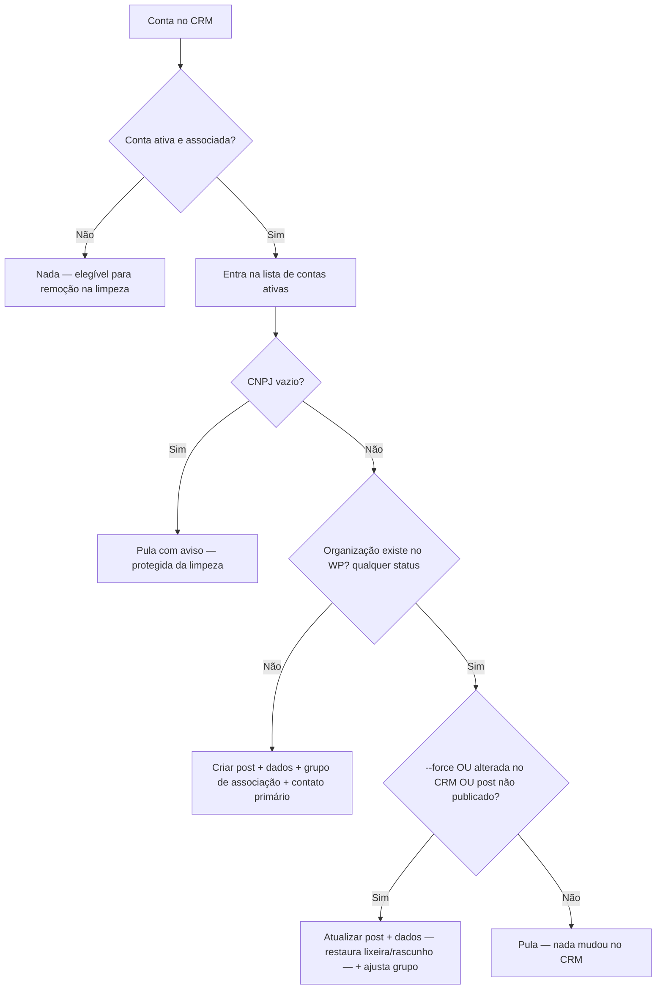
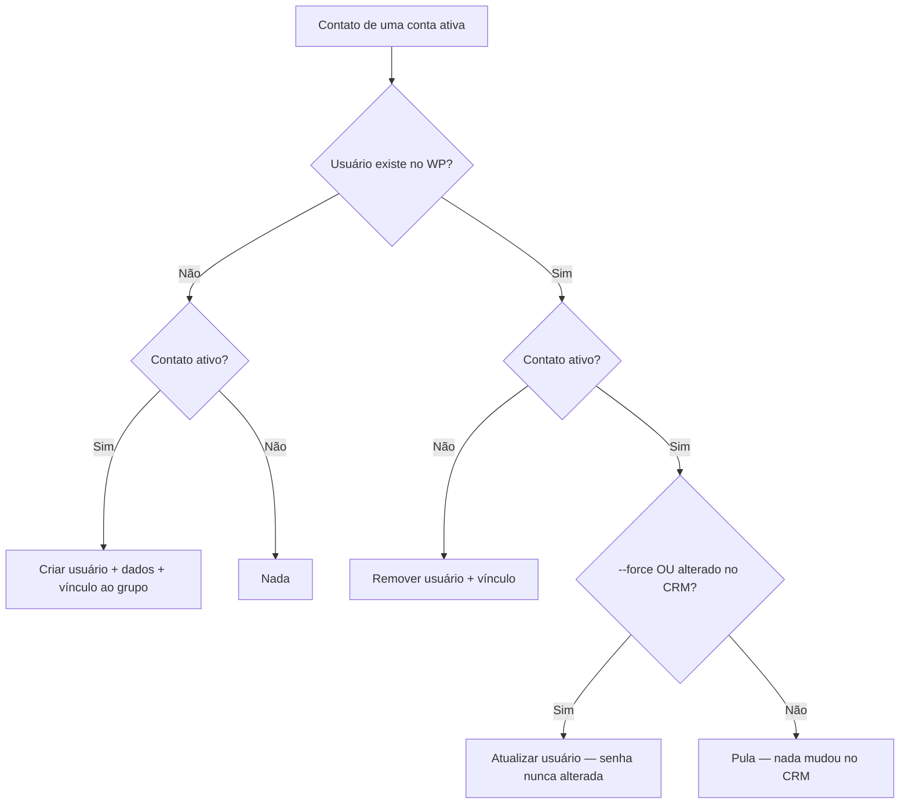

# Sincronização CRM → WordPress (Migração Incremental)

Este documento descreve o comportamento da sincronização incremental entre o
Dynamics 365 (fonte de verdade) e o WordPress. Escopo: **apenas o caminho
incremental** — o delta sync horário e a reconciliação semanal (ambos no tema,
`library/crm/cron.php`) estão planejados para remoção e não são cobertos aqui.

## Visão geral

O CRM espelha dois tipos de registro para o WP:

| Registro no CRM | Espelho no WP |
|---|---|
| Conta (organização) | Post `organizacao` + dados + grupo de associação (PMPro) |
| Contato (pessoa) | Usuário + dados + vínculo ao grupo da organização |

## Quando roda

| Mecanismo | Gatilho |
|---|---|
| Migração incremental diária | Todo dia às **02:00** (fuso de Brasília), via cron do servidor |
| Execução manual | `wp incremental-migration` (ou `wp incremental-migration --force`) |
| Proteção contra sobreposição | Uma execução por vez (bloqueio de 23h); se a anterior ainda estiver rodando, a nova é ignorada |

O agendamento diário é feito pelo tema (`library/cron.php`); o plugin executa.

## O que é "ativo"

- **Conta ativa:** conta ativa no CRM **e** com status de associação = *Associado* ou *Grupo Econômico*.
- **Contato ativo:** contato ativo no CRM **e** que pertence a uma conta ativa.

Contas ou contatos que deixam de atender a essas condições são tratados como
"inativos" e seguem para remoção (ver regras abaixo).

## Regras — Contas (organizações)

| Situação | Ação |
|---|---|
| Não existe no WP e é ativa | **Criar** a organização (post, dados e grupo de associação) |
| Existe no WP, é ativa e houve alteração no CRM desde a última sincronização (ou o post não está publicado) | **Atualizar** dados — publica novamente posts que foram para a lixeira — e ajusta o grupo (contato primário, alternativos, aprovador, usuários vinculados) |
| Existe no WP, é ativa e **nada mudou** no CRM | **Nada** (pula) |
| Existe no WP mas não é mais ativa | **Remover**: a organização, o grupo de associação e os usuários vinculados são excluídos definitivamente |
| Não existe no WP e não é ativa | Nada |
| Sem CNPJ cadastrado no CRM | Pula com aviso no log — a conta conta como ativa, portanto **nunca é removida** pela limpeza |

## Regras — Contatos (usuários)

| Situação | Ação |
|---|---|
| Não existe no WP e é ativo | **Criar** o usuário e vinculá-lo ao grupo da organização |
| Existe no WP, é ativo e houve alteração no CRM desde a última sincronização | **Atualizar** os dados — **a senha nunca é alterada** |
| Existe no WP, é ativo e **nada mudou** no CRM | **Nada** (pula) |
| Existe no WP mas não é mais ativo | **Remover** o usuário e seu vínculo ao grupo (exclusão definitiva) |
| Não existe no WP e não é ativo | Nada |

Cada usuário é identificado pelo seu contato e conta de origem no CRM
(metas `_ethos_crm_contact_id` e `_ethos_crm_account_id`).

## Como o sistema sabe que algo mudou

Ao sincronizar um registro, o WP guarda a data da última alteração que o CRM
informa para ele. Na execução seguinte, se essa data for a mesma, o registro é
pulado: nada mudou desde a última sincronização. Essa data fica gravada
automaticamente na meta `_ethos_crm:modifiedon` — não exige configuração nem
preparação do banco.

A execução com `--force` (`wp incremental-migration --force`) ignora essa
verificação e re-sincroniza tudo: dados, grupos e vínculos de usuários.

### Runbook: mudanças de mapeamento

Após qualquer deploy que altere como os dados do CRM são gravados no WP — o
que muda os parse functions ou seus helpers de transformação (`CompanySize`,
`Plan`, `compute_contact_role`, `generate_unique_email`,
`is_subsidiary_company`, `format_meta_value`) — rodar **uma vez**:

```bash
wp incremental-migration --force
```

Sem isso, registros já sincronizados mantêm os dados no formato antigo até que
o CRM os altere.

## Limpeza de organizações inativas e travas de segurança

Ao fim de cada execução, as organizações publicadas no WP são comparadas com as
contas ativas vistas na rodada. O que não apareceu como ativo é removido. Para
evitar remoções indevidas, a limpeza **é cancelada automaticamente** quando:

- nenhuma conta ativa foi encontrada na rodada (indício de falha de conexão
  com o CRM); ou
- o número de contas ativas cair mais de **50%** em relação à última execução
  bem-sucedida (indício de leitura incompleta do CRM — a paginação pode falhar
  de forma silenciosa).

Os identificadores dos registros são comparados sem diferenciar
maiúsculas/minúsculas, pois o CRM pode retorná-los com caixa diferente entre
consultas.

## Fluxogramas

### Contas



### Contatos



## Mapa do código

| Arquivo | Papel |
|---|---|
| `plugins/EthosMigrationPlugin/includes/crm.php` | Comando `incremental-migration` (`--force`), trava dos 50%, contadores, estatísticas |
| `plugins/EthosMigrationPlugin/includes/incremental-cron.php` | Execução diária, bloqueio de sobreposição, logs em arquivo |
| `plugins/EthosMigrationPlugin/includes/cleanup.php` | Limpeza de organizações inativas + travas de segurança |
| `themes/hacklab-theme/library/crm/importer.php` | Regras de importação (`import_account` / `import_contact`), verificação de alterações (`is_post_synced` / `is_user_synced`) |
| `themes/hacklab-theme/library/cron.php` | Agendamento diário (02:00) |
| `plugins/EthosDynamics365IntegrationPlugin/.../admin-menu.php` | Painel admin (status, última execução, logs) |
